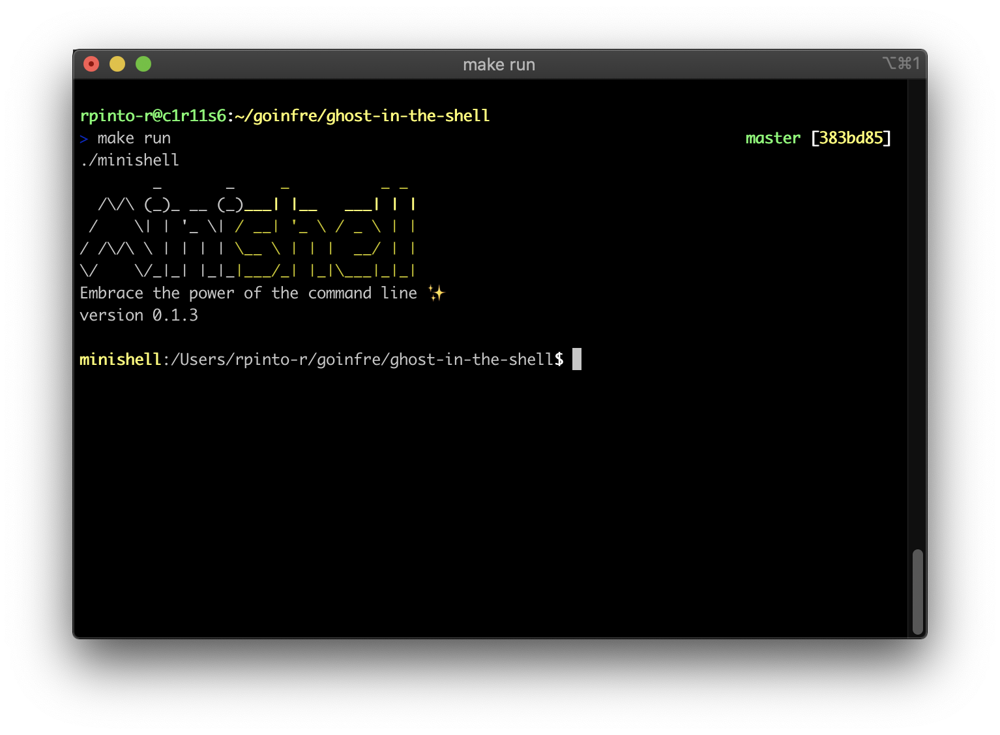

# 42 MiniRT
   [](https://github.com/ricardoreves/42-minishell/actions/workflows/norminette.yml) 

## 🪧 Overview
This project is about creating a simple shell. Yes, your own little bash. You will learn a lot about processes and file descriptors.

## 📷 Preview


## 🚀 Getting Started
### Installation
1. Clone the project.
```
git clone git@github.com:ricardoreves/42-minishell.git
```
2. Navigate to the project directory.
```
cd 42-minishell
```
3. Compile the minishell.
```
make
```

## 🕹 Usage
1. Run the minishell
```
make run
```

## 📚 References


## 🧰 Tools


## 📝 License
Distributed under the MIT License. See [LICENSE](LICENSE) for more information.


